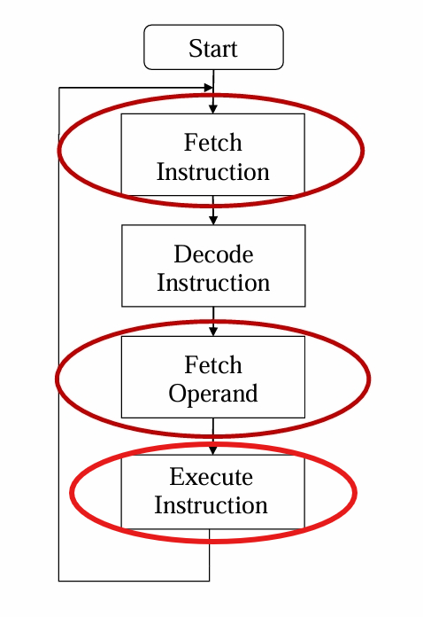
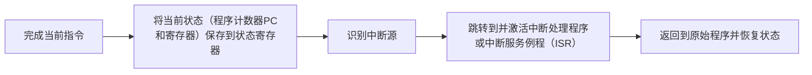
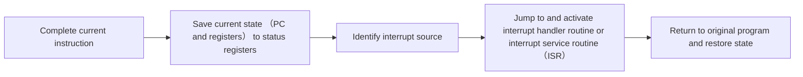

# Lec-4,5-The instruction cycle & interrupts (指令周期和中断)

## CPU的组成（The central processing unit）

[TOC]

在宏观上面看就是：控制器，运算器和寄存器

**CPU = ALU ➕ CU ➕（Register）** 

***ALU 算术逻辑单元（Arithmetic&logical Unit）***

***CU 控制单元（Control Unit）***

***Register 存储单元 ---- 寄存器***

https://www.cnblogs.com/gnivor/p/15679241.html

在CPU中，控制单元里面包含IR和PC，还有Memory Unit里面也包含IR和PC，两个组件（控制单元和存储单元）是相互包含的

## 寄存器（Register）

- 程序状态字寄存器（Program Status Word Register
- 通用寄存器（General Purpose Registers）
- **控制与状态寄存器（Control & Status Registers）**

以下都是AI翻译的，只有Control & Status Registers我认为重要一些

#### 程序状态字寄存器（Program Status Word Register, PSW）

- **功能**：PSW寄存器用于存储CPU的状态信息，包括各种标志位和控制位.
- **组成**：
  - **标志位**：用于指示最近一次运算的结果状态，常见的标志位有：
    - **零标志位（Zero Flag, ZF）**：如果运算结果为零，则置位.
    - **进位标志位（Carry Flag, CF）**：用于表示无符号数运算的进位状态.
    - **溢出标志位（Overflow Flag, OF）**：用于表示有符号数运算的溢出状态.
    - **符号标志位（Sign Flag, SF）**：表示运算结果的符号，结果为负则置位.
    - **奇偶校验标志位（Parity Flag, PF）**：用于表示运算结果中1的个数是否为偶数.
  - **控制位**：用于控制CPU的某些操作，如中断使能位（Interrupt Enable Flag）等.
- **作用**：PSW寄存器中的状态信息可以用于条件判断和控制程序的执行流程，如条件分支指令会根据标志位的状态来决定程序的跳转方向.

#### 通用寄存器（General Purpose Registers, GPR）

- **功能**：通用寄存器用于存储数据和地址，它们可以用于各种目的，如数据传输、算术运算、地址计算等.
- **特点**：
  - **数量和大小**：不同CPU架构的通用寄存器数量和大小不同，通常有多个寄存器，每个寄存器可以存储一个字长的数据.
  - **灵活性**：通用寄存器可以用于多种操作，没有固定的用途限制，程序员可以根据需要灵活地使用它们.
- **作用**：通用寄存器为CPU提供了临时存储空间，使得数据可以在寄存器之间快速传输和处理，提高了程序的执行效率.

#### 控制与状态寄存器（Control & Status Registers, CSRs）

- **功能**：控制与状态寄存器用于存储CPU的控制信息和状态信息，它们通常用于特定的控制和状态管理.
- **组成**：
  - **程序计数器（Program Counter, PC）**：存储下一条要执行的指令的地址.
  - **指令寄存器（Instruction Register, IR）**：存储当前正在执行的指令.
  - **内存地址寄存器（Memory Address Register, MAR）**：存储要访问的内存地址.
  - **内存缓冲寄存器（Memory Buffer Register, MBR）**：存储从内存读取或要写入内存的数据.
- **作用**：控制与状态寄存器为CPU的指令执行和数据传输提供了必要的控制和状态支持，确保CPU能够正确地执行程序和管理数据流动.

在计算机架构中，IR（指令寄存器）、PC（程序计数器）、ALU（算术逻辑单元）和CU（控制单元）共同协作完成CPU的指令执行过程。以下是它们如何一起工作的详细解释：

1. **程序计数器（PC）**：
   - PC用于存储下一条要执行的指令的地址。每当一条指令被执行后，PC会自动递增，指向下一条指令。

2. **指令寄存器（IR）**：
   - IR用于暂时存储从内存中取出的当前指令。当CPU需要从内存中读取新指令时，该指令首先被加载到IR中。

3. **控制单元（CU）**：
   - CU是CPU的控制中心，负责从内存中取指令、译码，并调度其他部件执行操作。CU根据用户预先编好的程序，依次从存储器中取出各条指令，放在指令寄存器IR中，通过指令译码确定应该进行什么操作，然后向相应的部件发出微操作控制信号。

4. **算术逻辑单元（ALU）**：
   - ALU负责执行基本的算术运算（如加、减、乘、除）和逻辑运算（如与、或、非）。它接受控制单元CU的命令，进行具体的计算工作

### CPU中具体的工作流程如下：

- **取指令（Fetch）**：
  - 控制单元CU从PC获取指令地址，并将该地址送入内存地址寄存器（MAR）。
  - CU发出读取指令，将内存中指定地址的指令读取到内存数据寄存器（MDR）。
  - 然后，指令从MDR传送到IR寄存器中。

- **指令译码（Decode）**：
  - IR中的指令被送入CU进行译码，CU分析指令的操作码，确定需要执行的操作类型，并生成相应的控制信号。

- **执行指令（Execute）**：
  - 根据CU生成的控制信号，ALU执行指令中指定的算术或逻辑运算。
  - 如果指令需要操作数，CU会控制从寄存器或内存中读取操作数到ALU。

- **访存取数（Memory Access）**：
  - 如果指令需要从内存中读取数据，CU会控制内存读取操作，将数据从内存传送到寄存器或ALU。

- **结果写回（Writeback）**：
  - 执行完毕后，ALU将结果数据写回到寄存器或内存中，以备后续使用或作为输出。

整个过程中，CU作为指挥中心，协调PC、IR和ALU的工作，确保指令能够正确、有序地执行。

（我自己画的，啧~）

### Data Fetch

两者的差距就是一个来自直接在寄存器或内存里面

一个是来自于寄存器或内存指向的地址

#### direct addressing（直接寻址）

IR (instruction register) is examined

#### indirect addressing（间接寻址）

The address field of instruction gives the address where the effective address is stored in memory.

## Exceptions（异常）

  
  

    这张图片展示了指令周期，在这三个阶段都会出错,这里就是三种异常的产生方式。
  

**Polling（轮询）**：这是一种极其低效的方式

### 为什么要使用异常

 Some devices can be many orders of magnitude slower than the CPU. Instead of waiting, the CPU continues with other calculations. The device interrupts the CPU when the device/data is ready.

### 处理异常的流程（General interrupt flow）

#### Multiple interrupts （多个中断的处理）
- Approach 1 disregards the urgency of any interrupt(忽略任何中断的紧急性)
- Approach 2: Define priorities (nested interrupt)定义优先级（嵌套中断）
  -  Low priority interrupts can be interrupted by higher priority interrupts.
  - When the higher priority interrupt has been processed the processor returns to the previous interrupt

## CPU structures and pipelining

这节课相对简单，主要讲了寄存器的发展（其实在上节课如果弄明白寄存器的一些相关的原理之后不用看这个（这里不写了）），数据流数据提取的两种方式（直接寻址和间接寻址），和流水线（Pipelining，它可以提高运行效率）

### Pipelining

我觉得原理的英文表达要记一下

Pipelining attempts to maximise instruction throughput by overlapping the execution of multiple instructions（流水线试图通过重叠执行多个指令来最大化指令吞吐量）

**特殊情况**

引入Branch penalty（分支惩罚）

Control dependence当存在控制依赖的时候，启动branch prediction（分支预测）

