# Cache Memory Related Work

这是计算机体系结构里面最重要的部分

[TOC]

## 概念性问题

#### Performance parameters(性能参数)

- **Capacity:** The capacity of the memory is the number of bytes (or preferably words) it can store.

- **Word---字长（或字大小）**：是数据组织的自然单位。它通常等于表示整数所需的位数和指令的长度。换句话说，字长是计算机处理数据的基本单位大小，通常与整数的位数和指令的长度一致

- **Transfer rate:**Transfer rate is the rate at which data can be moved. • E.g., Mbytes / second

- **Access time(访问时间)：** Access time (or latency) is the time between presenting the address and receiving or storing the valid data

- **Memory cycle time:** 

  访问时间（Access time）+  恢复时间（Recovery time）

- **Unit of Transfer(转移单元)：**可以转移的一块数据的最大量

- **Access Method(访问方法):**

  - Sequential access
  - Direct access
  - Random access

#### **Semiconductor memory(半导体存储器)**

- **RAM **

  "随机"这个词在这里可能会引起误解。在计算机科学中，"随机存取"（Random Access）并不是指数据的访问是随机的，而是指数据可以被直接访问，而不需要按顺序访问其他数据。

  - SRAM(static RAM)

    更快，在cache里面使用

  - DRAM(dynamic RAM)

    比较便宜，volatile（容易丢失）

    • A refresh circuit is included on the chip.（刷新电路包括在芯片上）
    • It disables the chip while refreshing.（它在刷新时禁用芯片）
    • It loops through the rows, reading and then writing
    back the contents of each cell.（它循环遍历行，阅读然后写回每个单元格的内容）
    • The apparent performance is reduced.（表观性能降低）

- **ROM**

  (只读存储器）提供永久的数据存储，不能改变

- **Flash memory**

#### 错误检测

- **Parity bit（奇偶校验位）：**Using a (redundant) bit to detect and correct an one-bit error. 使用（冗余）位检测和纠正一位错误(具体怎么校验的不用管了，老师没有教)
- **Hamming Distance（汉明距离）：**用来衡量错误多少的一种计数方式
- **Checksum（校验和）**

#### 使用cache这种小型存储的好处

Use small, fast (but expensive) storage to store the most frequently used data

- **Temporal locality(时间局部性):** recently referenced addresses are likely to be referenced again (reuse)
- **Spatial locality(空间局部性):** If a memory address is referenced, nearby addresses are likely to be referenced soon

#### 评估指标

- **hit time**: Access time of a hit is the hit time(命中的访问时间是命中时间)
- **miss penalty**: The additional time (much slower) to fetch a block on a miss is called the miss penalty(在未命中时获取块的额外时间（慢得多）称为未命中惩罚)
- **Miss rate = #misses / #accesses**（未命中率=未命中次数/访问次数）

## 映射（Important！！！）

### Direct-Mapped Caches(直接映射缓存)

### Associative Cache Mappings(全相联缓存映射)

###  Set-associative Caches(组相联缓存)

### Cache Block Replacement Policies(缓存替换策略)

- **随机选择（Random choice）**  
  随机选择一个块进行替换。

- **先进先出（First in first out, FIFO）**  
  替换在缓存中停留时间最长的块。

- **最近最少使用（Least recently used, LRU）**  
  替换在缓存中停留时间最长且没有被引用的块。

- **最少使用（Least frequently used, LFU）**  
  替换命中次数最少的块。

### Write Policies for Caches(CPU与缓存交互)

- **CPU想要读取数据**：
  - **缓存命中（Cache hit）**：数据在缓存中找到.
  - **缓存未命中（Cache miss）**：数据不在缓存中，需要从内存中加载.
    - **替换一个块（Evict a block）**：在缓存未命中时，需要替换缓存中的一个块以腾出空间.

- **CPU想要写入数据**：
  - **写命中（Write hit）**：缓存中包含该块，可以直接在缓存中写入.
    - ***写穿透(Write-through caches)***：写操作同时更新缓存和内存中的数据.
    - ***写返回(Write-back caches)***：写操作只更新缓存中的数据，当缓存块被替换时才将修改写回内存.
  - **写未命中（Write miss）**：缓存中不包含该块，需要先将数据写入内存，然后可能将其加载到缓存中.
    - ***写分配(Write Allocate)***：将数据加载到缓存中，然后在缓存中进行写操作.
    - ***写绕过(Write around)***：直接将数据写入内存，而不加载到缓存中.

在这里最重要的是**写穿透(Write-through caches)，写返回(Write-back caches)，写分配(Write Allocate，)写绕过(Write around)**

**这两个是怎么两两组合的？**

写分配和写回相搭配：修改cache

写穿透和写绕过搭配：修改内存

##  Operating System Support（操作系统）

#### Memory protection（存储器保护）

限制用户程序可以访问的内存部分

### Memory partition（内存分配方式）

##### Fixed (static)-sized memory partition（固定（静态）大小的内存分区）

Internal fragmentation: the available partition may be larger than what was requested by the process – some memory will be wasted

内部碎片：可用分区可能比进程请求的分区大，这会浪费一些内存。

就是你用多大我给你比你这个大一点的最接近你的

##### Variable Sized (dynamic) Partitions（可变大小（动态）分区）

就是你用多大我给你多大

#### Virtual Memory（虚拟存储）

##  Virtual Memory ---- Page(Important！！！)

### 概念

- **虚拟页(Virtual Page)**

  虚拟页是程序在虚拟地址空间中看到的内存单位。程序通过虚拟页号和页内偏移来访问内存。

- **物理帧(Physical frame)**

  通常是和虚拟页一对一映射

- **页表(Page Table)**

  页表是一个数据结构，用于记录虚拟页到物理帧的映射关系。每个页表项（Page Table Entry, PTE）包含虚拟页号、对应的物理帧号以及访问权限等信息。

### 关系

**1 virtual addr. access = 2 physical memory access**

### Page faults(页面错误)

```mermaid
graph TD
    subgraph 中文
        A1[程序访问虚拟地址] --> B1[页表项指示页面在磁盘]
        B1 --> C1[硬件（CPU）生成页错误异常]
        C1 --> D1[操作系统检索数据从磁盘]
        D1 --> E1[操作系统选择一个页面从RAM中置换出去并写入磁盘]
        E1 --> F1[操作系统从磁盘读取页面并放入RAM]
        F1 --> G1[操作系统更新页表以映射新页面]
        G1 --> H1[操作系统跳回到导致页错误的指令]
        H1 --> I1[重新执行指令，此时不会导致页错误，因为页面已加载到内存]
    end
    subgraph English
        A2[Program accesses virtual address] --> B2[Page table entry indicates page is on disk]
        B2 --> C2[Hardware （CPU） generates a page fault exception]
        C2 --> D2[OS retrieves data from disk]
        D2 --> E2[OS selects a page to evict from RAM and write to disk]
        E2 --> F2[OS reads the page from disk and puts it in RAM]
        F2 --> G2[OS updates the page table to map the new page]
        G2 --> H2[OS jumps back to the instruction that caused the page fault]
        H2 --> I2[Re-execute the instruction, this time won't cause a page fault since the page has been loaded into memory]
    end
```

